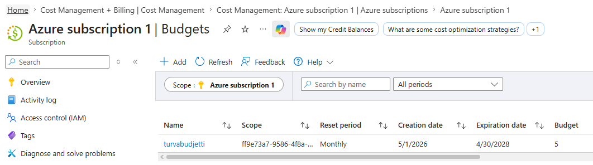
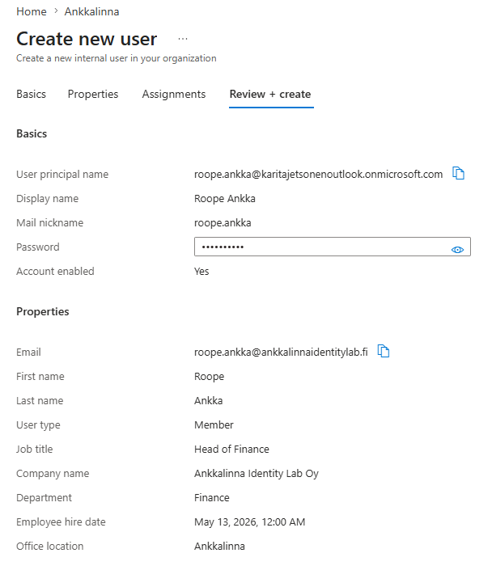
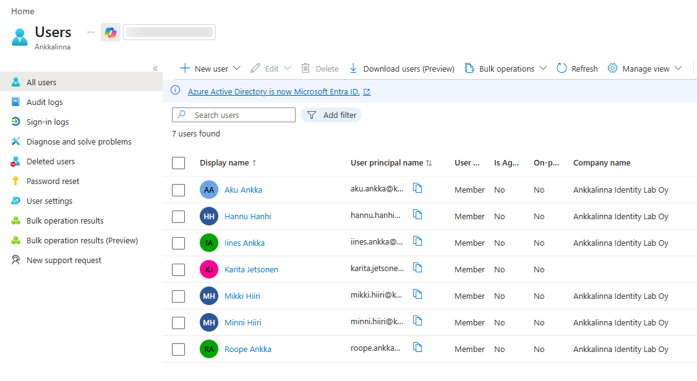

# 01 - The Setup

This is the starting point of my Microsoft Entra ID lab.

I wanted to build a small test environment where I can practise Identity and Access Management without touching real company data, real users or production systems.

The lab is based on a fictional company called **Ankkalinna Identity Lab Oy**.

Fictional users make it safer to document the work publicly and easier to build realistic access scenarios without exposing any real customer or employee information.

## What I started with

For the first setup, I created:

- an Azure free account
- a Microsoft Entra tenant
- a fictional tenant display name: **Ankkalinna**
- test users for different departments
- security groups for basic access modelling
- screenshots for documentation

The goal was not to build a perfect enterprise environment on day one.

The goal was to create a simple base that I can expand into more realistic IAM scenarios.

## Lab idea

The lab uses fictional users, departments and roles.

This helps me practise questions like:

- who needs access?
- why do they need it?
- what group should give that access?
- who owns the access?
- what happens when someone changes role?
- how can old access be reviewed and removed?

I do not want this lab to be only about where buttons are in the portal.

I want to understand the access logic behind the configuration.

## Security note

Real tenant identifiers, technical tenant details and any sensitive information are not published in this repository.

## Test users

The first users are fictional characters with different work roles.

| User | Department | Role |
|---|---|---|
| Aku Ankka | IT Support | Support Specialist |
| Iines Ankka | HR | HR Specialist |
| Roope Ankka | Finance | Head of Finance |
| Mikki Hiiri | Security | Security Specialist |
| Minni Hiiri | Application Management | Application Owner |
| Hannu Hanhi | Sales | Sales Representative |

These users give the lab a simple company structure.

For example, Roope needs finance-related access, but that does not mean he should have technical admin rights.

Mikki works with security, so he is a useful test user for future privileged access examples.

Hannu is useful for future role creep cases, because he can be used to demonstrate how access can accumulate over time if role changes are not reviewed properly.

## First setup steps

This is what I did first:

1. Created an Azure free account
2. Opened Microsoft Entra admin center
3. Checked the tenant overview
4. Changed the tenant display name to Ankkalinna
5. Created fictional test users
6. Created the first security groups
7. Took screenshots while building the lab
8. Started documenting the setup in GitHub

## Screenshots

### Budget safety

Before building the lab further, I created a small Azure budget alert.

This helps me avoid accidental costs while learning.

### Creating test users

I created fictional test users for the Ankkalinna Identity Lab Oy environment.

### Starter users

The first users represent different departments and access needs.

### Group membership example

Roope Ankka is Head of Finance, so he belongs to finance-related groups.

## Why this matters

This setup gives me a safe base for learning IAM.

Instead of randomly creating users and groups, I can build small cases around real IAM problems:

- joiner, mover and leaver processes
- group-based access
- application access
- privileged access
- access reviews
- role creep
- approval flows

This is only the first step, but now the lab has a structure.

## Next step

The next page continues with security groups, naming logic and initial memberships.
