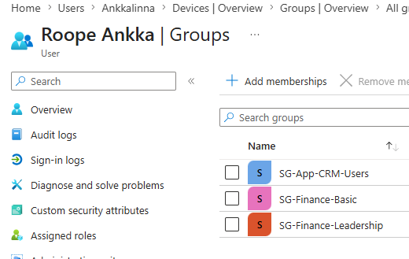
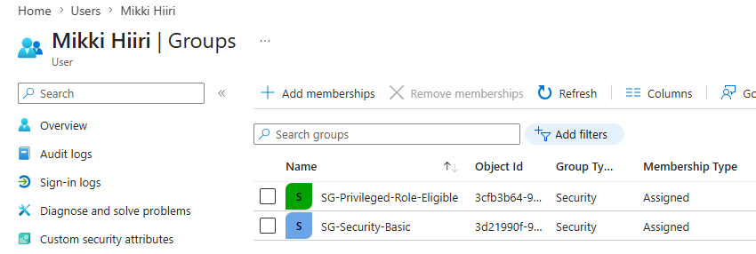

# Security Groups and Memberships

This page documents the first security groups and user memberships in my Ankkalinna Entra ID lab.

The goal is to practise group-based access management instead of giving permissions directly to individual users.

This is still a simple first version. I wanted to build a clean base before making the lab more complex.

## Why security groups?

Security groups help keep access more structured.

Instead of giving access one user at a time, users can be added to groups based on their department, role or application need.

This makes access easier to:

- give
- remove
- review
- document
- troubleshoot later

For this first setup, I used assigned group membership.

Dynamic groups can be tested later, but I wanted to understand the basic group model first.

## Group naming

I used a simple naming pattern: SG-[Area]-[Purpose]

Examples:
- SG-HR-Basic
- SG-Finance-Leadership
- SG-App-CRM-Users
- SG-App-CRM-Owners

`SG` means security group.

The goal is that the group name already gives a basic idea of what the group is for.

## Groups created

| Group name | Purpose | Example member |
|---|---|---|
| SG-IT-Support-Basic | Basic access for IT support users | Aku Ankka |
| SG-HR-Basic | Basic access for HR users | Iines Ankka |
| SG-Finance-Basic | Basic access for finance users | Roope Ankka |
| SG-Finance-Leadership | Sensitive finance leadership access | Roope Ankka |
| SG-Security-Basic | Basic access for security users | Mikki Hiiri |
| SG-Sales-Basic | Basic access for sales users | Hannu Hanhi |
| SG-App-CRM-Users | Standard access to the fictional CRM application | Hannu Hanhi, Roope Ankka |
| SG-App-CRM-Owners | Owner-level access to the fictional CRM application | Minni Hiiri |
| SG-Privileged-Role-Eligible | Planning example for privileged access | Mikki Hiiri |

## Membership overview

| User | Role | Groups | Reason |
|---|---|---|---|
| Aku Ankka | Support Specialist | SG-IT-Support-Basic | Needs basic IT support access |
| Iines Ankka | HR Specialist | SG-HR-Basic | Needs basic HR access |
| Roope Ankka | Head of Finance | SG-Finance-Basic, SG-Finance-Leadership, SG-App-CRM-Users | Needs finance leadership access and CRM visibility |
| Mikki Hiiri | Security Specialist | SG-Security-Basic, SG-Privileged-Role-Eligible | Needs security access and is useful for privileged access planning |
| Minni Hiiri | Application Owner | SG-App-CRM-Owners | Owns the fictional CRM application |
| Hannu Hanhi | Sales Representative | SG-Sales-Basic, SG-App-CRM-Users | Needs sales access and CRM user access |

## Department-based access

Some groups are based on the user’s department or work area.

Examples:

- `SG-IT-Support-Basic`
- `SG-HR-Basic`
- `SG-Finance-Basic`
- `SG-Security-Basic`
- `SG-Sales-Basic`

The idea is simple: users get basic access based on where they work.

For example, Iines works in HR, so she belongs to `SG-HR-Basic`.

This is cleaner than giving random permissions directly to each user.

## Application access

I created two CRM-related groups:

- `SG-App-CRM-Users`
- `SG-App-CRM-Owners`

`SG-App-CRM-Users` is for people who use the fictional CRM application.

Example members:

- Hannu Hanhi
- Roope Ankka

`SG-App-CRM-Owners` is for the application owner.

Example member:

- Minni Hiiri

This separates normal users from application owners.

That matters later when practising access reviews, approvals and application ownership.

## Example: Roope Ankka

Roope Ankka works as Head of Finance.

He belongs to:

- `SG-Finance-Basic`
- `SG-Finance-Leadership`
- `SG-App-CRM-Users`

Roope needs finance-related access and may need CRM visibility for business reporting.

But Head of Finance does not mean technical administrator.

Business authority and technical admin access are two different things.

Roope can approve finance-related things without needing broad admin rights in the tenant.

## Example: Mikki Hiiri

Mikki Hiiri works as a Security Specialist.

He belongs to:

- `SG-Security-Basic`
- `SG-Privileged-Role-Eligible`

This makes him useful for future privileged access examples.

Security work may require elevated access, but elevated access should still be controlled.

It should not be permanent by default.

## Future use: Hannu Hanhi and role creep

Hannu Hanhi works in Sales.

He belongs to:

- `SG-Sales-Basic`
- `SG-App-CRM-Users`

Hannu is useful for a future role creep case.

For example, if Hannu moves to another department, his old sales and CRM access should be reviewed.

This is a common IAM problem: users collect access over time, but old access is not always removed.

## What I learned

Groups should have a clear purpose.

Group membership should also have a clear reason.

Before creating a group or adding a user to a group, I should be able to answer:

- what is this group for?
- what access does it represent?
- who should belong to it?
- why does this user need it?
- who would approve or review this access later?
- how would this access be removed if the user changes role?

If the reason is unclear, the access probably needs to be reviewed.
