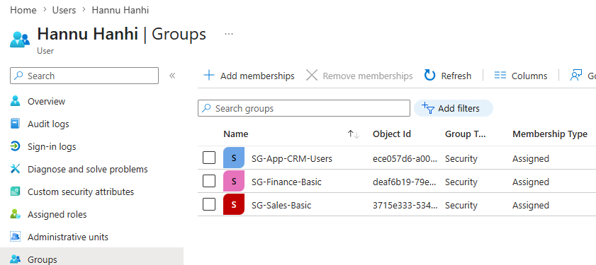
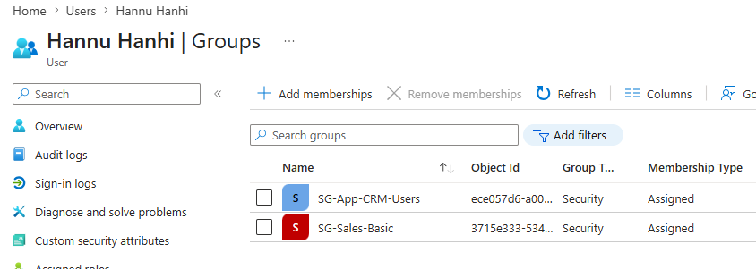

# Role Creep Case: Hannu Hanhi

This page documents a small role creep scenario in my Ankkalinna Entra ID lab.

The goal is to practise how old access can stay behind when a user changes role or collects permissions over time.

## What is role creep?

Role creep means that a user slowly collects more and more access over time.

This can happen when the user:

- changes department
- gets temporary access
- helps another team
- works on a project
- covers for another person
- gets access that is never removed later

The problem is not always one big mistake.

Often it is many small access decisions that are not cleaned up.

## Scenario

Hannu Hanhi works as a Sales Representative at Ankkalinna Oy.

At the start of the lab, he belongs to:

- `SG-Sales-Basic`
- `SG-App-CRM-Users`

This makes sense because Hannu works in Sales and needs CRM access for customer-related work.

Later, Hannu helps the Finance team with a short reporting project.

For that project, he is added to:

- `SG-Finance-Basic`

The access is meant to be temporary.

But after the project ends, nobody removes it.

Now Hannu still has finance access even though he works in Sales.

That is role creep.

## Current access

| User | Role | Groups |
|---|---|---|
| Hannu Hanhi | Sales Representative | SG-Sales-Basic, SG-App-CRM-Users |

## Temporary project access

| Added group | Reason | Intended duration |
|---|---|---|
| SG-Finance-Basic | Short finance reporting project | Temporary |

## Problem

The project ends, but Hannu is still a member of `SG-Finance-Basic`.

This creates unnecessary access.

Hannu may not be doing anything wrong, but the access model is now weaker.

The risk is that a user has access they no longer need.

## Why this matters

Old access can create security and compliance problems.

If users keep access from old roles or projects, the organization may lose track of who can see what.

This can affect:

- sensitive data protection
- least privilege
- access reviews
- audit readiness
- incident impact
- trust in the access model

## IAM principle

Access should follow current need.

If the business reason no longer exists, the access should be removed.

Temporary access should not become permanent by accident.

## Better process

A better process would include:

- clear reason for temporary access
- owner or approver for the access
- end date for temporary access
- review after the project ends
- removal of access when it is no longer needed

## Example access review questions

When reviewing Hannu’s access, I would ask:

- Does Hannu still work in Sales?
- Does Hannu still need CRM access?
- Why does Hannu have finance access?
- Is there still a business reason for it?
- Who approved it?
- When should it be removed?

## Expected cleanup

If Hannu no longer needs finance access, he should be removed from:

- `SG-Finance-Basic`

His normal access should remain:

- `SG-Sales-Basic`
- `SG-App-CRM-Users`

## Before cleanup

| User | Groups |
|---|---|
| Hannu Hanhi | SG-Sales-Basic, SG-App-CRM-Users, SG-Finance-Basic |

## After cleanup

| User | Groups |
|---|---|
| Hannu Hanhi | SG-Sales-Basic, SG-App-CRM-Users |

---

## Screenshot: before cleanup

Hannu has temporary finance access that should be reviewed.

## Screenshot: after cleanup

The unnecessary finance access was removed.

---

## What I learned

Role creep is not always caused by bad intentions.

It can happen because temporary access is added quickly and nobody owns the cleanup.

This is why access should be documented, reviewed and connected to a real business need.

A small access decision can become a long-term risk if nobody checks it later.
