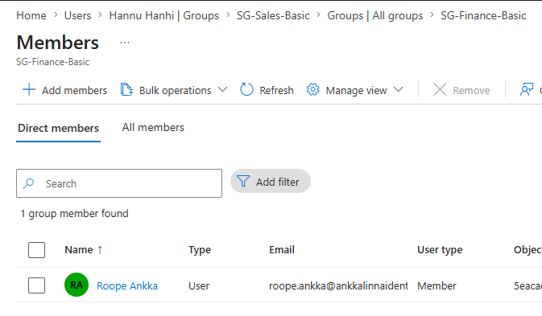

# Manual Access Review Simulation

This page documents a manual access review simulation in my Ankkalinna Entra ID lab.

This is not an automated Entra ID Governance access review.

The purpose is to practise the review logic manually first:

- what group is reviewed
- who should review it
- what members are checked
- what decision is made
- what evidence is captured
- what cleanup is done after the review

The focus is not the portal button.

The focus is the decision.

## Review scope

For this simulation, I reviewed the group:

| Group | Purpose | Risk level | Reviewer |
|---|---|---|---|
| SG-Finance-Basic | Basic finance access | High | Head of Finance / Finance Owner |

This group is a good review target because finance access can expose sensitive business data.

Even basic finance access should not be treated like generic office access.

## Review question

The review question is simple:

> Does each member still need this access for their current role?

This is the important part.

The review is not only checking whether the user is listed in the group.

The review should challenge whether the membership still makes sense.

## Current members before review

| User | Current role | Review decision | Reason |
|---|---|---|---|
| Roope Ankka | Head of Finance | Keep | Current finance leadership role |
| Hannu Hanhi | Sales Representative | Remove | Temporary finance project access is no longer needed |

## Finding

The review found that Hannu Hanhi was still a member of `SG-Finance-Basic`.

Hannu works in Sales.

He had finance access because of a temporary reporting project, but that project is no longer active.

This means the access no longer matches his current role.

The issue is not that Hannu did anything wrong.

The issue is that the access stayed behind after the business need ended.

## Review decision

| User | Decision | Action |
|---|---|---|
| Roope Ankka | Keep access | No change |
| Hannu Hanhi | Remove access | Remove from SG-Finance-Basic |

The decision should be based on current need, not old history.

If there is no current business reason, the access should not stay.

## Cleanup action

After the review, Hannu Hanhi was removed from `SG-Finance-Basic`.

His normal Sales and CRM access remained unchanged.

| User | Access after cleanup |
|---|---|
| Hannu Hanhi | SG-Sales-Basic, SG-App-CRM-Users |
| Roope Ankka | SG-Finance-Basic, SG-Finance-Leadership, SG-App-CRM-Users |

## Evidence captured

For this review, the useful evidence is:

| Evidence | Purpose |
|---|---|
| Screenshot before review | Shows original group membership |
| Review decision table | Shows who was reviewed and what decision was made |
| Screenshot after cleanup | Shows that unnecessary access was removed |
| Written reason | Explains why the access was removed |

The evidence does not need to be huge.

It needs to be clear enough that someone can understand the review later.

## What this review shows

This review shows why group membership should not be trusted forever.

Access can be correct when it is granted and wrong later.

That is why reviews matter.

The real value of an access review is not that someone clicks “review complete”.

The value is that old access is found, challenged and removed when it no longer makes sense.

## Practical takeaway

A manual access review is simple, but it still needs structure.

A useful review should have:

- clear scope
- correct reviewer
- current role context
- keep or remove decision
- cleanup action
- evidence after the decision

A review without cleanup is only a list.

A review with a decision and action is control.
